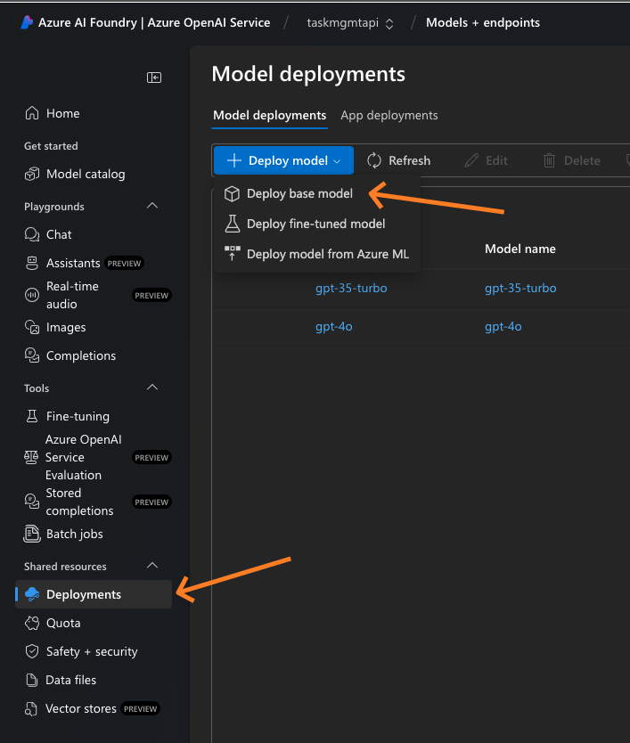
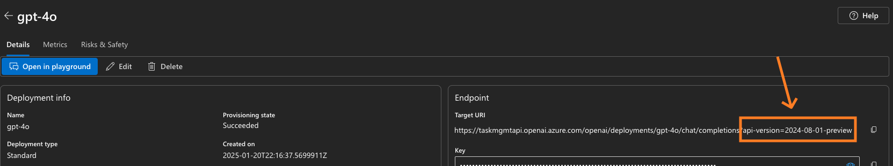

# README.md

# Azure OpenAI Connectivity Project

This project demonstrates how to connect to Azure OpenAI services using TypeScript. It includes configuration settings, API interaction methods, and type definitions for requests.

## Project Structure

```
azure-openai-app
├── src
│   ├── config.ts           # Configuration settings for Azure OpenAI
│   ├── openai.ts           # OpenAI client methods
│   └── types
│       └── index.ts        # Type definitions for requests
├── openai.ts               # Implements OpenAI client wrapper for Azure OpenAI services with completion and chat endpoints
├── main.ts                 # Entry point demonstrating OpenAI client usage with example completion and chat API requests
├── .env                    # Environment variables for sensitive information
├── package.json            # Project dependencies and scripts
├── pnpm-lock.yaml          # Locked versions of dependencies
├── tsconfig.json           # TypeScript configuration
└── README.md               # Project documentation
```

## Setup Instructions

1. Clone the repository:
   ```
   git clone <repository-url>
   cd azure-openai-app
   ```

2. Install dependencies using pnpm:
   ```
   pnpm install
   ```

3. Set up Azure OpenAI Service:
   - Navigate to the Azure Portal (https://portal.azure.com)
   - In the search bar, type "Azure OpenAI"
   - Click "Create" to set up a new Azure OpenAI resource
   - Follow the configuration wizard to complete the setup

4. Deploy AI Models
   - Navigate to the AI Foundry (https://ai.azure.com)
   - Select a Model and confirm, takes 1-2 mins to complete
   

5. Create a `.env` file in the root directory and add your Azure OpenAI API key and endpoint URL.

6. for ai model api version, click the deployed model
   

7. Compile the TypeScript files:
   ```
   pnpm run build
   ```

8. Run the application:
   ```
   pnpm start
   ```

## License

This project is licensed under the MIT License.
